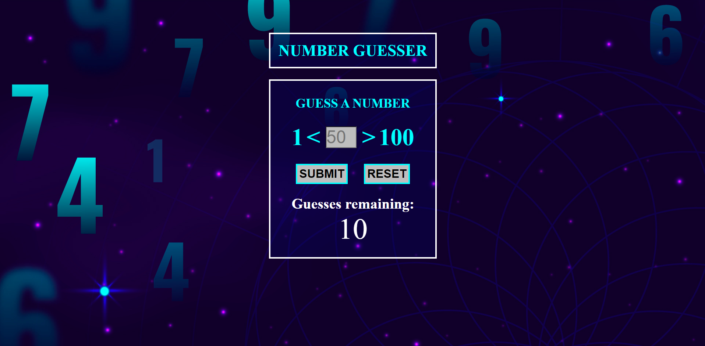
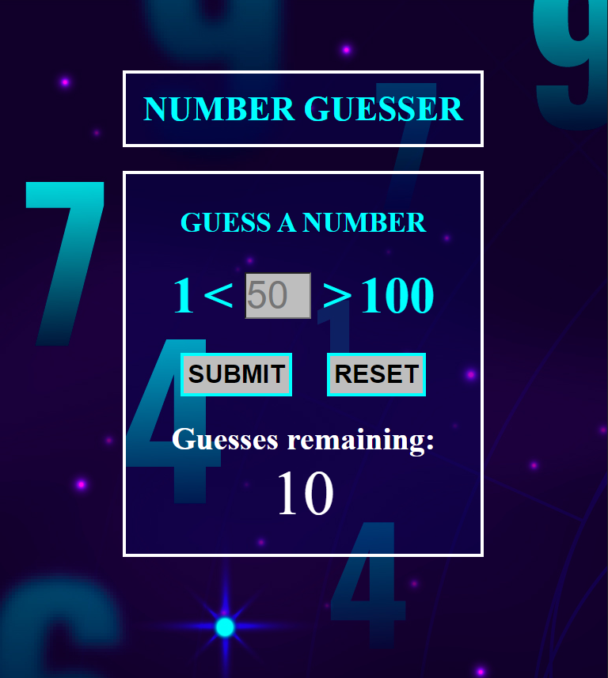
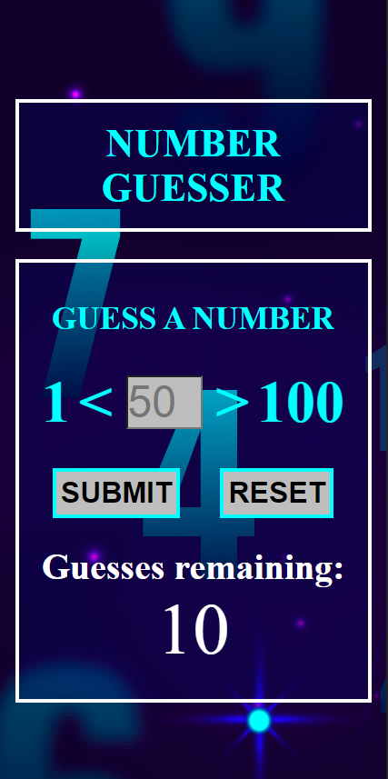
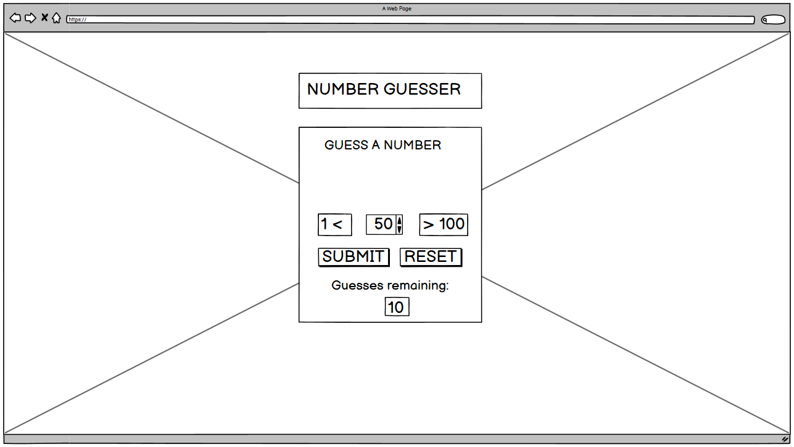
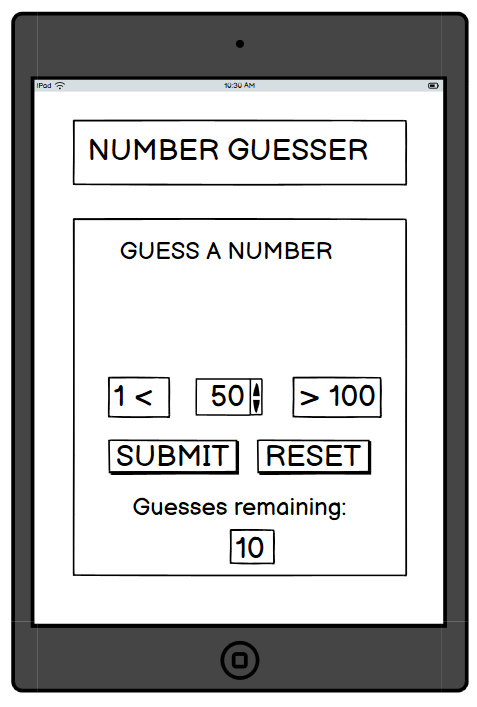
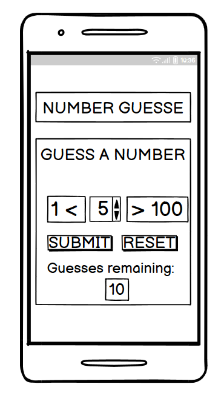
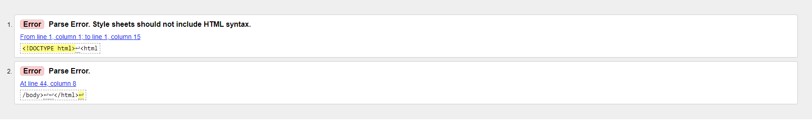
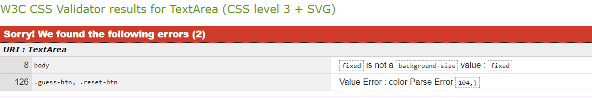
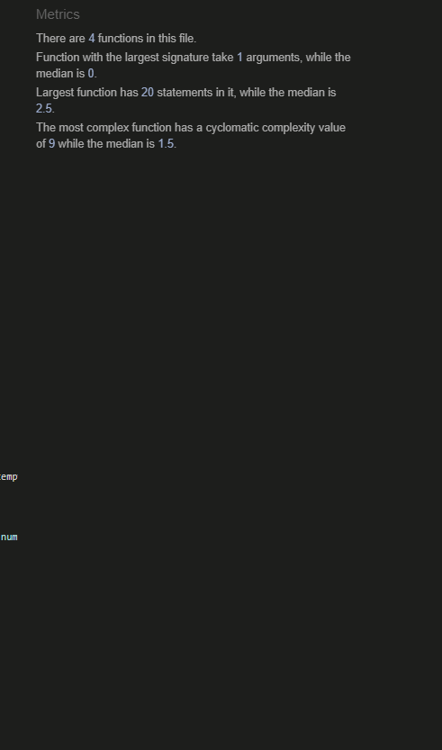

# Number Guesser

## UX

## User Stories

As a user I can see if my guess is either to high or to low.

As a user I can submit my guess with the enter key

As a user I can see how many guesses I have remaining until game over

As a user I can reset the game at ay point by clicking a button

  ## Structure

  ### Site Wireframes

  - __Home Page__

  

-__Home Page Mobile View__

## Wireframe Design:

### Design

#### Selected Colors

The chose colors are: Dark semi-transparent blue with light blue & white text.

### fonts

I stuck with the default font as I think it looks clean and is easy to read.

### Media

## Technologies Utilised

- HTML

- CSS3

- JavaScript

## Testing

Number Guesser was tested on Chrome & Opera

### Validating

- HTML

  - [HTML Validation](https://validator.w3.org/nu/)

  

- CSS

  -[CSS Validation](https://jigsaw.w3.org/css-validator/)

  

- JavaScript
  -[JSHint](https://jshint.com/)

  

- Lighthouse tools were also utilised to test the website.

Desktop:

My background image came from freepik. (<a href="https://www.freepik.com/free-vector/gradient-numerology-background_36154130.htm#query=numbers%20background&position=0&from_view=keyword&track=ais_hybrid&uuid=2273b09f-c079-4a8c-9b37-a63f15b42321">Image by freepik</a>)

### Content

### Media

All images were taken from [Unsplash](https://unsplash.com/)

## Acknowledgements

